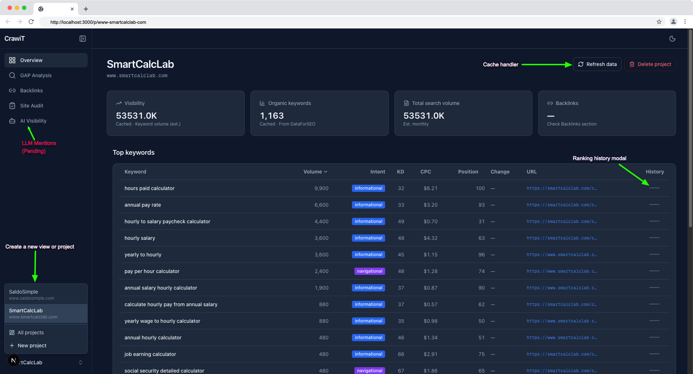

# CrawliT SEO Dashboard

CrawliT SEO Dashboard — Next.js, Tailwind, and DataForSEO. Project-based workspace with GAP Analysis, Backlinks, Site Audit, and AI Visibility. Ready to deploy on Vercel.

## Screenshot

Sube tu captura o logo en la carpeta **`assets/`** del proyecto (por ejemplo `assets/screenshot.png`) y añade en este README:

```markdown

```

O pega la línea donde quieras que se vea la imagen.

## Author

**Rusben Madrigal**  
- Web: [www.rusmadrigal.com](https://www.rusmadrigal.com)  
- LinkedIn: [linkedin.com/in/rusmadrigal](https://www.linkedin.com/in/rusmadrigal/)

## Repo structure

- **`next-app/`** – CrawliT app (Next.js 16, App Router): project-based SEO dashboard with GAP Analysis, Backlinks, Site Audit, AI Visibility, and DataForSEO integration.

## Local development

### Main app (next-app)

```bash
cd next-app
npm install
cp .env.example .env.local   # optional: add DATAFORSEO_API_KEY
npm run dev
```

Open [http://localhost:3000](http://localhost:3000). Default route is `/p/default/keywords`.

### DataForSEO

1. Create `next-app/.env.local` and add your API key as Base64:
   ```bash
   # Generate: printf '%s' 'YOUR_LOGIN:YOUR_PASSWORD' | base64
   DATAFORSEO_API_KEY=your_base64_here
   ```
2. In the app, go to **Help → DataForSEO API key** for the full setup guide.

## Deploy (Vercel)

1. Connect this repo to [Vercel](https://vercel.com).
2. Set **Root Directory** to `next-app` (or deploy the `next-app` folder only).
3. Add the `DATAFORSEO_API_KEY` environment variable in the Vercel project.
4. Deploy.

## Stack

- **Next.js 16** (App Router)
- **TypeScript**
- **Tailwind CSS**
- **lucide-react**
- **DataForSEO** (keyword research via API)

## License

MIT © Rusben Madrigal. See [LICENSE](LICENSE).
